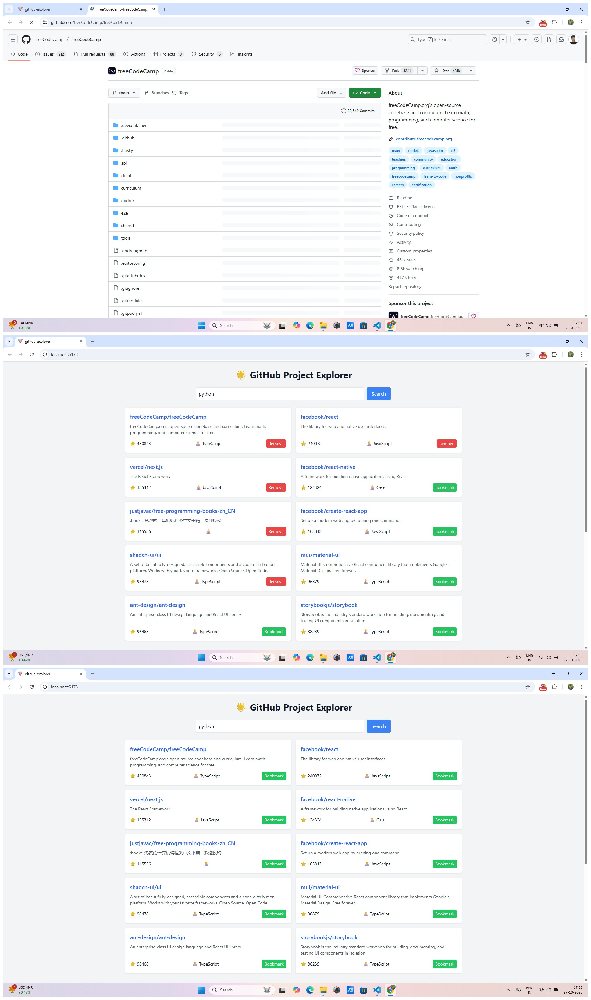

🚀 Project Title:
Open Source GitHub Project Explorer

🎯 Objective:

Build a responsive React dashboard that explores trending GitHub repositories with advanced filters and visualizations.

🧰 Tools & Technologies:

Frontend: React.js + Tailwind CSS

API: GitHub REST API (https://api.github.com
)

Charts: Chart.js (via react-chartjs-2)

State Management: useState + useEffect

Extras (Optional): Local Storage (for bookmarks/notes)

✅ Features Recap
Feature	Description
🔍 Search	Search repositories by keyword
🌟 Sort	Sort by stars, updated date
🏷️ Filter	Filter by language or topic
📊 Charts	Show stars or issues via Chart.js
💾 Bookmark	Save favorite repos locally
📝 Notes	Add personal notes to bookmarked repos

